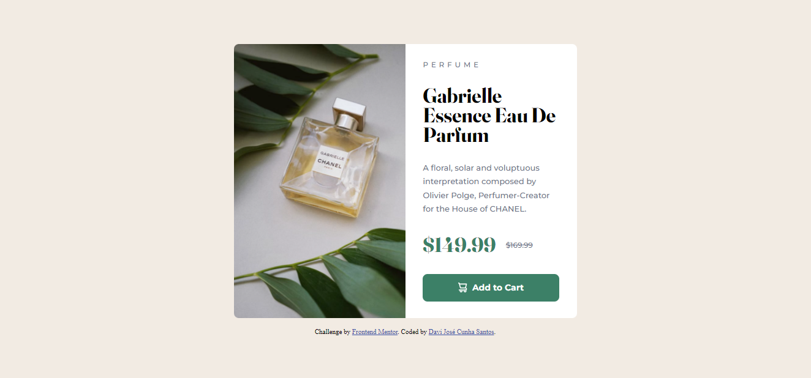

# Frontend Mentor - Product preview card component solution

This is a solution to the [Product preview card component challenge on Frontend Mentor](https://www.frontendmentor.io/challenges/product-preview-card-component-GO7UmttRfa). Frontend Mentor challenges help you improve your coding skills by building realistic projects. 

## Table of contents

- [Overview](#overview)
  - [The challenge](#the-challenge)
  - [Screenshot](#screenshot)
  - [Links](#links)
- [My process](#my-process)
  - [Built with](#built-with)
  - [What I learned](#what-i-learned)
- [Author](#author)

## Overview

### The challenge

Users should be able to:

- View the optimal layout depending on their device's screen size
- See hover and focus states for interactive elements

### Screenshot



### Links

- Solution URL: [Solution](https://github.com/Dex64ter/Product-preview-card)
- Live Site URL: [Site](https://dex64ter.github.io/Product-preview-card/)

## My process

### Built with

- Semantic HTML5 markup
- CSS custom properties
- Flexbox
- CSS Grid
- Mobile-first workflow

### What I learned

In this challenge, my hardest task was the adjust the image and the description of product to screen size appropriate, instead use \ tag, I used a tag with _background-img_, this estrategy is common but hard too when we have to resize the components.

How I did what I saw:

```html
<!-- html into <main id="main"></main> tag -->
<div class="image-prod" alt="perfume image"></div>
```
```css
/* a part of page's css */
#container {
  max-width: 35rem;
  height: 28rem;

  display: flex;
  align-items: center;

  border-radius: 0.5rem;
}

.image-prod {
  background: var(--bg-image);
  background-size: cover;
  width: 50%;
  border-radius: 0.5rem 0 0 .5rem;
  height: 100%;
}
```

The JS was not necessary.

## Author

- Website - [Portifólio](https://dex64ter.github.io)
- Frontend Mentor - [@Dex64ter](https://www.frontendmentor.io/profile/Dex64ter)
- Instagram - [@davijozedjs](https://www.instagram.com/davijozedjs/)

